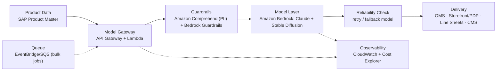

# SkechAI Reference Architecture — Product Copy Generation

This document sketches how the MVP's use case (structured shoe attributes →
wholesale, DTC, and localized selling copy) would productionize on AWS as one use
case on the shared SkechAI platform. It's a single flow, not a deep system design —
enough to talk through what sits around the model call and why.

## System diagram

Open `architecture/diagram.html` in a browser for a clean, screenshot-ready render of
the same diagram.

## Walkthrough

**Product Data.** Attributes come from the SAP Product Master — a verified system of
record, not free text someone types in. The MVP's form stands in for this; a
production version would hydrate a request from that system directly.

**Model Gateway.** A single front door for every model call — API Gateway in front of
a Lambda router that authenticates the caller, logs the request/response, and is
model-agnostic (it knows how to call "the language model," not "Claude
specifically"). That's what lets a model get swapped or a fallback added without
touching every use case built on top of it.

**Guardrails.** Amazon Comprehend redacts PII on the way in, and Bedrock Guardrails
plus a grounding check run on the way out, before anything is allowed downstream.
This is the production version of the MVP's `governance` block: in the MVP the model
self-reports whether it stayed grounded; in production that self-report is a signal,
not a control — something else verifies it against the source attributes.

**Model Layer.** A privately-instanced Claude on Amazon Bedrock for language, Stable
Diffusion for imagery. Private instancing matters for a brand like Skechers because
product data and draft creative never leave a controlled boundary.

**Reliability Check.** If a call fails or a response fails its guardrail/grounding
check, retry or fall back to a secondary model rather than surfacing a raw failure.
Not every use case needs this on day one, but a bulk job (regenerating copy ahead of
a catalog drop) turns a single bad response into an operational annoyance if nothing
retries it.

**Delivery.** The guardrail-passed copy lands where it's actually used — OMS,
storefront/PDP, the wholesale line-sheet workflow, the DTC CMS. The MVP stops at
"render the JSON on screen"; production stops at "the PDP is updated."

**Observability & Queue (cross-cutting).** CloudWatch taps the gateway and model
layer for logs and metrics, and AWS Cost Explorer rolls that up into spend per use
case so platform owners aren't reading raw logs to answer "what is this costing us."
A queue (EventBridge/SQS) in front of the gateway absorbs bulk jobs — thousands of
SKUs ahead of a launch — instead of firing thousands of synchronous calls at once.

## NFR mapping

| NFR | Where it lives |
|---|---|
| **Security** | Private VPC boundary, key/secret management (no keys in the client — same principle as the MVP's server-only route), and the Guardrails step (PII redaction + grounding). |
| **Scalability** | Serverless autoscale in the gateway plus the queue for bulk/batch jobs. |
| **Extensibility** | New use cases (imagery, size-chart Q&A, review summarization) plug into the same gateway instead of getting their own integration. |
| **Adaptability** | The model-agnostic gateway can route to or swap models without changing call sites — the MVP's `MODEL` constant is the same idea at demo scale. |
| **Self-healing** | The Reliability Check — retry or fallback model — so a degraded model doesn't need a human to intervene before the next request succeeds. |

## What the MVP deliberately does not do

- No retrieval — attributes come from the form, not SAP Product Master.
- No independent grounding verification — the `governance` block is the model's
  self-report, not a second system checking it.
- No queueing, retries, or fallback model — one call, one response, and a friendly
  error if it fails.
- No auth — this is a local demo, not a multi-tenant deployment.

Each of these is a named gap above on purpose — the MVP proves the model interaction
and the guardrail contract; the rest is what it would take to run this for real.
